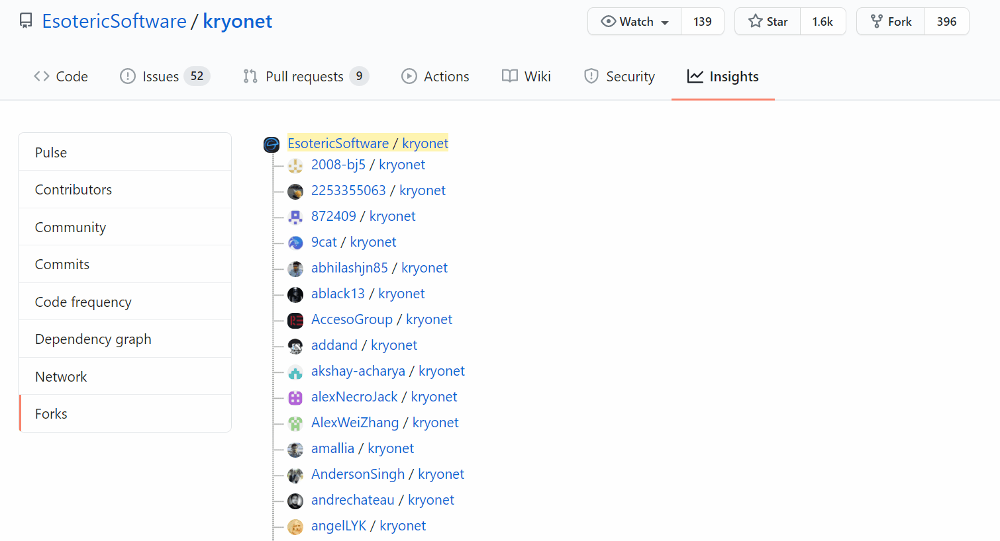

# Useful Forks
Chrome extension, adding a sorted list of starred forks to the GitHub forks page. Results are filtered out if there were never any commits pushed since the fork was created.

Not published, if you want to install it, enable `Developer mode` (switch at the top-right) at the `chrome://extensions` URL and load the `project` folder as an unpacked extension (`Load unpacked` button at the top-left).

You should change the [script file](project/useful_forks.js) so that it includes your GitHub username and an [Access Token](https://github.com/settings/tokens/new?scopes=repo&description=UsefulFork).

## For devs
The extension uses [content_scripts](https://developer.chrome.com/extensions/content_scripts#declaratively).

## To-do
* Search all forks (paginated results for > 100)
* Publish as a chrome extension
* Allow people to input their Access Token to increase API limits (from Extension's settings rather than through script)