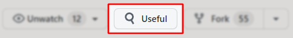

# Useful Forks
[](https://github.com/useful-forks/useful-forks.github.io/blob/master/LICENSE)
[](https://github.com/useful-forks/useful-forks.github.io/issues)

---

This tool enhances the discoverability of useful forks for open-source projects by providing a list of forks worth exploring.

The results are filtered to exclude forks that have never had any commits pushed to the main branch since their creation.

Sometimes, a project might be abandoned, or someone had a different idea of how it should be implemented... and when you go looking for those interesting forks, you find yourself searching through potentially hundreds of them. This tool is here to help you discover the hidden jewels you were looking for!

## Table of Content
* [Releases](#releases)
  * [Online tool](#online-tool)
  * [Chrome extension](#chrome-extension)
  * [Bookmarklet](#bookmarklet)
* [How it works](#how-it-works)
* [Contributing](#contributing)
* [Credits](#credits)

---

## Releases
There are several ways to access the tool.

If you use Chrome, your best option would be to download the [Chrome extension](#chrome-extension). For other browsers, you may want to use the [bookmarklet](#bookmarklet).

### Online tool
The project is [available online](https://useful-forks.github.io/) for free thanks to GitHub Pages.

You can query a repository directly with the URL. Click this link to get an example: https://useful-forks.github.io/?repo=payne911/PieMenu.

Below is a recording of what a scan would look like:


### Chrome extension
Head to [Chrome's Web Store](https://chrome.google.com/webstore/detail/useful-forks/aflbdmaojedofngiigjpnlabhginodbf) to install the published extension.

Once it's activated, the extension will automatically add a new "Useful" button on all GitHub repository pages:



Here is what happens when you click it:


This button will only appear when you visit GitHub repositories, and clicking it opens a new tab that will automatically trigger a search using [the online tool](#online-tool).

Please note that this project will not be updating the [GitHub Releases](https://github.com/useful-forks/useful-forks.github.io/releases) page anymore. We will now go through Chrome's Web Store to publish updates.

### Bookmarklet

The online tool can be used as a [bookmarklet](https://en.wikipedia.org/wiki/Bookmarklet). To add one manually, press `Ctrl+D` to create a new bookmark and add this code in the URL field:

```js
javascript:!function(){if(m=window.location.href.match(/github\.com\/([\w.-]+)\/([\w.-]+)/),m){window.open(`https://useful-forks.github.io/?repo=${m[1]}/${m[2]}`)}else window.alert("Not a GitHub repo")}();
```

When you're viewing a GitHub repo in your browser, you can press the newly created bookmarklet and this will open the online tool for the repo in a new tab.

## How it works


This Activity Diagram (UML) should clarify a bit the inner-workings of the algorithm, and why it may some times require so many API calls.

## Contributing
If you want to help, the structure of the repo is rather simple. In terms of folders:
* [`website`](/website) contains the website
* [`plugin`](/plugin) contains the Chrome Extension

### Website instructions
To run the website locally, you will need:
* NodeJS (suggested v14.15+)
* NPM (suggested v6.14+)

Bring a terminal to the ``website`` folder and execute `npm install`, and then `npm run dev`.

If after running `npm run dev` you get an error that mentions "`code: 'ERR_OSSL_EVP_UNSUPPORTED'`", [this](https://stackoverflow.com/a/69746937/9768291) should be able to help.

Whenever you want to test changes to the `src/queries-logic.js` file, you will need to re-execute `npm run dev` for `dist/main.js` to recompile.

## Credits
* Thanks to [raeleus](https://github.com/raeleus) for his design of the logo!
* Thanks to [jkunstwald](https://github.com/jkunstwald/) for allowing me to apply the MIT license to what has been expanded from [his own initial work](https://github.com/jkunstwald/useful-forks). Here is a list of the improvements that were made:
  * Recursive search of all sub-forks
  * GitHub API's `Watchers` value is bugged so it was removed
  * Implement authenticated requests to the GitHub API (which increases the limit of calls)
  * Added some minimal feedback for certain edge-cases
  * Created an actual website for the feature
  * The Chrome extension leads to the (more powerful) website
* Thanks to [`star-history`](https://star-history.t9t.io/#useful-forks/useful-forks.github.io)'s [open-source website](https://github.com/bytebase/star-history/tree/c0e7aa7cc01d5bab9188fc7d2a2bac409d2915ec/website) which I adapted for this project
