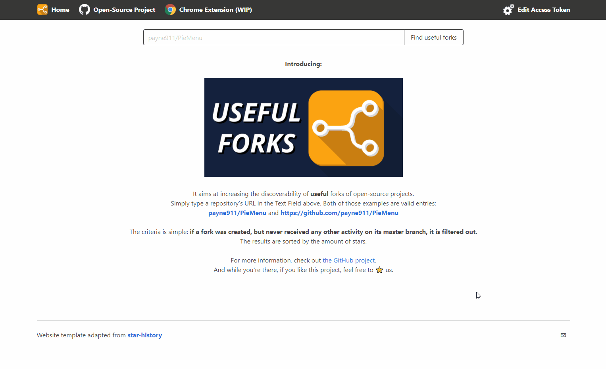
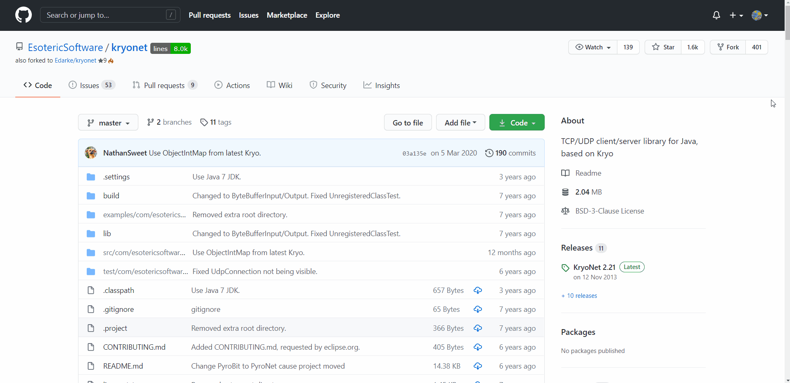

# Useful Forks

---

Adding a sorted list of starred forks to the GitHub forks page. Results are filtered out if there were never any commits pushed on the main branch since the fork was created.

This is meant to help increase the discoverability of useful forks of open-source projects.

Some times, a project might be abandoned, or someone had a different idea of how it should be implemented... and when you go looking for those interesting forks, you find yourself searching through potentially hundreds of them. This tool is here to help you discover the hidden jewels you were looking for!

## Table of Content
* [Releases](#releases)
  * [Website](#website)
  * [Chrome extension](#chrome-extension-wip) (WIP)
  * [`refined-github`](#refined-github)
* [How it works](#how-it-works)
* [Contributing](#contributing)
* [Credits](#credits)

---

## Releases
The project is released as:
1. A website: great for people that just want to use this tool every now and then.
2. A Chrome extension: has the advantage of always performing the search whenever you open a project's GitHub Forks page.
3. A feature in [`refined-github`](https://github.com/sindresorhus/refined-github)

### Website
The project is [available online](https://useful-forks.github.io/) thanks to GitHub Pages.

You can query repository directly with the URL. Here is an example: https://useful-forks.github.io/?repository=kotcrab/vis-ui

### Chrome extension (WIP)
Not published yet. If you want to install it:
1. Clone this repository
2. Change the [script file](plugin/useful-forks.js) so that `GITHUB_ACCESS_TOKEN`'s value is that of an [Access Token](https://github.com/settings/tokens/new?description=useful-forks%20(no%20scope%20required))
3. Go to the `chrome://extensions` URL
4. Enable `Developer mode` (switch at the top-right)
5. Click `Load unpacked` (button at the top-left)
6. Select the [`plugin` folder](plugin)

Once it's activated, the extension will automatically trigger itself whenever you open a Fork page, as shown by the GIF below:

### `refined-github`
[`refined-github`](https://github.com/sindresorhus/refined-github) is an ensemble of tools and tweaks aimed at improving your GitHub experience.

`useful-forks` is part of the dozens of features provided. In that context, it appears as a button which redirects you to the [`useful-forks` website](https://useful-forks.github.io/):

## How it works

This Activity Diagram (UML) should clarify a bit the inner-workings of the algorithm, and why it may some times require so many API calls.

## Contributing
If you want to help, the structure of the repo is rather simple. In terms of folders:
* [`website`](/website) contains the website
* [`plugin`](/plugin) contains the Chrome Extension

### Website instructions
To run the website locally, you will need:
* NodeJS (suggested v14.15+)
* NPM (suggested v6.14+)

Bring a terminal to the ``website`` folder and execute `npm install`, and then `npm run dev`.

Whenever you want to test changes to the `src/queries-logic.js` file, you will need to re-execute `npm run dev` for `dist/main.js` to recompile.

## Credits
* Thanks to [raeleus](https://github.com/raeleus) for his design of the logo!
* Thanks to [jkunstwald](https://github.com/jkunstwald/) for allowing me to apply the MIT license to what has been expanded from [his own initial work](https://github.com/jkunstwald/useful-forks). Here is a list of the improvements that were made:
  * Recursive search of all sub-forks
  * GitHub API's `Watchers` value is bugged so it was removed
  * Implement authenticated requests to the GitHub API (which increases the limit of calls)
  * Added some minimal feedback for certain edge-cases
  * Created an actual website for the feature
  * Position the chrome extension's results where they won't move the other links of the page
* Thanks to [`star-history`](https://star-history.t9t.io/#useful-forks/useful-forks.github.io)'s [open-source website](https://github.com/timqian/star-history/tree/master/website) which I adapted for this project
